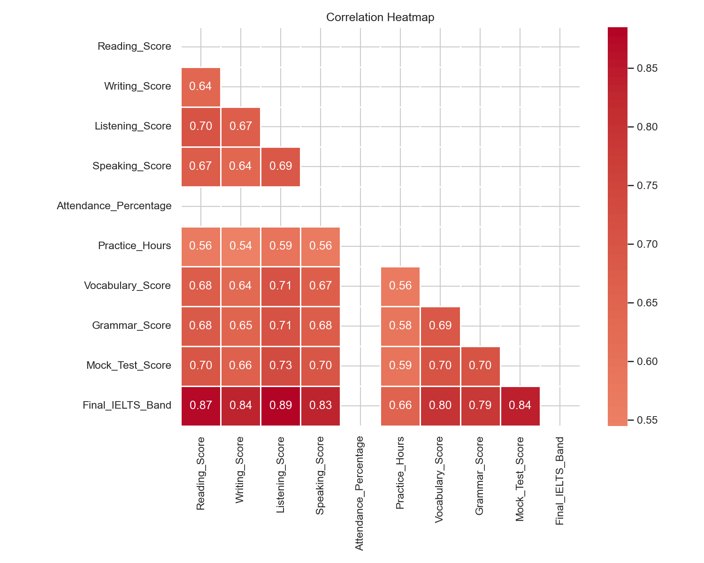
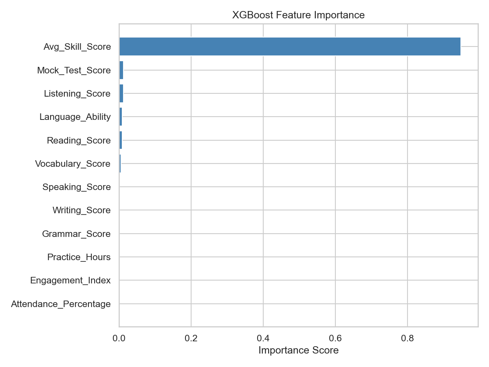

# IELTS Performance Prediction System


A machine learning system that predicts a student's IELTS band score (1–9) from assessment records and behavioural learning features. Trained on 5,000 student records using Linear Regression, Random Forest, and XGBoost with 5-fold cross-validation.

---

## Results

| Model | RMSE | MAE | R2 | CV RMSE (5-fold) |
|---|---|---|---|---|
| **Linear Regression** | **0.158** | **0.128** | **0.981** | **0.153** |
| XGBoost | 0.164 | 0.134 | 0.980 | 0.163 |
| Random Forest | 0.169 | 0.137 | 0.979 | 0.169 |

> Best model: **Linear Regression** — RMSE 0.158, R2 0.981 on a held-out test set of 1,000 records.

---

## Project Structure

```
IELTS-Performance-Prediction/
├── data/
│   ├── raw/                      # Original dataset (5,000 rows)
│   └── processed/                # Cleaned / transformed data
├── notebooks/
│   ├── eda.ipynb                 # Exploratory Data Analysis
│   ├── model_training.ipynb      # Training + evaluation
│   └── kaggle_notebook.ipynb     # Self-contained Kaggle notebook
├── src/
│   ├── generate_dataset.py       # Synthetic data generator
│   ├── retrain.py                # Quick CLI retrain script
│   ├── preprocessing.py          # Load, split, scale
│   ├── feature_engineering.py    # Composite features
│   ├── train.py                  # Model definitions + CV
│   └── evaluate.py               # Metrics + comparison table
├── models/                       # Saved model + scaler (.pkl)
├── results/                      # Plots and CSV outputs
├── app.py                        # Streamlit prediction app
└── requirements.txt
```

---

## Dataset

Synthetic dataset of **5,000 student records** generated with realistic feature correlations.

| Feature | Description |
|---|---|
| Reading_Score | IELTS Reading component score (1–9) |
| Writing_Score | IELTS Writing component score (1–9) |
| Listening_Score | IELTS Listening component score (1–9) |
| Speaking_Score | IELTS Speaking component score (1–9) |
| Attendance_Percentage | Class attendance (40–100%) |
| Practice_Hours | Weekly self-study hours (0.5–10) |
| Vocabulary_Score | Vocabulary assessment score (20–100) |
| Grammar_Score | Grammar assessment score (20–100) |
| Mock_Test_Score | Full mock test band score (1–9) |
| **Final_IELTS_Band** | **Target — actual IELTS band achieved** |

---

## Key Findings

- **Linear Regression** achieved the best performance: RMSE 0.158, R2 0.981
- **Reading Score**, **Listening Score**, and **Mock Test Score** are the strongest predictors
- **Attendance**, **Practice Hours**, and **Grammar Score** contribute meaningfully — confirming that behaviour matters alongside raw ability
- 5-fold cross-validation confirmed strong generalisation with low variance (CV RMSE 0.153 ± 0.004)
- Composite features (Avg Skill Score, Language Ability, Engagement Index) added useful signal

---

## EDA Highlights

| Correlation Heatmap | Feature Importance |
|---|---|
|  |  |

---

## Quick Start

```bash
# 1. Clone the repo
git clone https://github.com/Sarthakyadav98/IELTS-Performance-Prediction-System.git
cd IELTS-Performance-Prediction-System

# 2. Create and activate virtual environment
python -m venv .venv
.venv\Scripts\activate        # Windows
# source .venv/bin/activate   # macOS / Linux

# 3. Install dependencies
pip install -r requirements.txt

# 4. Generate dataset + train models
python src/generate_dataset.py
python src/retrain.py

# 5. Launch the Streamlit app
streamlit run app.py
```

---

## Tech Stack

| Tool | Purpose |
|---|---|
| Pandas / NumPy | Data manipulation |
| Scikit-learn | Linear Regression, Random Forest, preprocessing, CV |
| XGBoost | Gradient boosted trees |
| Matplotlib / Seaborn | EDA visualisations |
| Streamlit | Interactive prediction app |
| Joblib | Model serialisation |